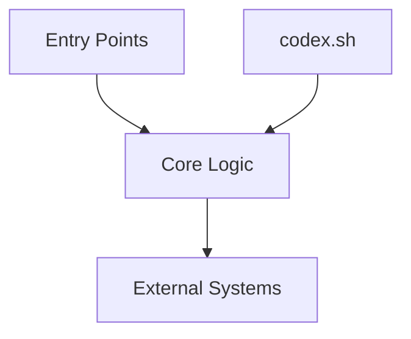

# Architecture Overview

```mermaid
flowchart TD
    A[Entry Points] --> B[Core Logic] --> C[External Systems]
    D[codex.sh] --> B
```

**Interfaces**: Discord API, FetLife adapter, Telegram API, Management Web UI
**Critical paths**: deployment, testing, release flows
